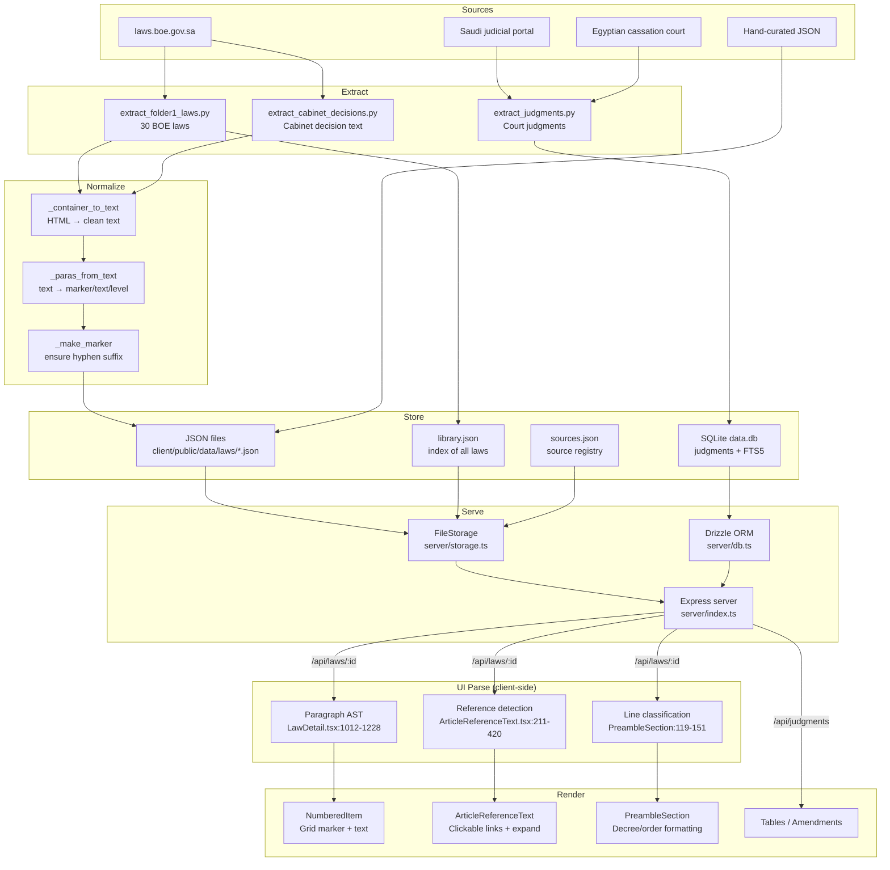

# Architecture

## End-to-end data flow

## Stage-by-stage: where each lives in code

### 1. Extract (Python scripts)

| Script | Purpose | Input | Output |
|--------|---------|-------|--------|
| `scripts/extract_folder1_laws.py` | Full law extraction from BOE | BOE HTML pages | `*_boe.json` files + `library.json` + `boe_laws_index.json` |
| `scripts/extract_cabinet_decisions.py` | Cabinet decision text only | BOE HTML pages | Adds `cabinet_decision_text` to existing JSON |
| `scripts/check_instruments.py` | Diagnostic: shows instrument types | Local JSON files | stdout |
| `extract_judgments.py` | Court judgment extraction | External judicial sources | SQLite `data.db` |
| `scripts/add_to_library.py` | Register new law in library index | Local JSON | Updates `library.json` |

Source: `scripts/` directory

### 2. Normalize (inside extraction scripts)

| Function | File | Purpose |
|----------|------|---------|
| `_container_to_text()` | `extract_folder1_laws.py:124-153` | HTML → clean multi-line text (no span leakage) |
| `_paras_from_text()` | `extract_folder1_laws.py:177+` | Split text into `{marker, text, level}` paragraphs |
| `_make_marker()` | `extract_folder1_laws.py:167-174` | Ensure markers end with `-` |
| `_clean()` | `extract_folder1_laws.py:108-119` | Remove tatweel, zero-width chars, normalize whitespace |
| `_arabic_num()` | `extract_folder1_laws.py:94-105` | Convert Arabic ordinal/numeral text to integer |

### 3. Store

| File | Format | What |
|------|--------|------|
| `client/public/data/laws/{id}.json` | JSON | Full law with articles, paragraphs, royal decree, amendments |
| `client/public/data/laws/{id}_boe.json` | JSON | BOE-extracted law (same schema, `_boe` suffix) |
| `client/public/data/library.json` | JSON array | Index of all laws for library page |
| `client/public/data/sources.json` | JSON array | Source registry (BOE, Umm Al-Qura, NCA) |
| `client/public/data/regulations.json` | JSON | Regulations linked to parent laws |
| `data.db` | SQLite | Judgments table + FTS5 index |

Source: `server/storage.ts` (FileStorage), `server/db.ts` (SQLite)

### 4. Serve (Express)

| Route | Handler | Storage method |
|-------|---------|----------------|
| `GET /api/sources` | `routes.ts:39-42` | `storage.getSources()` → reads `sources.json` |
| `GET /api/library` | `routes.ts:44-47` | `storage.getLibrary()` → reads `library.json` |
| `GET /api/laws/:id` | `routes.ts:49-56` | `storage.getLaw(id)` → reads `{id}.json` or `{id}_boe.json` |
| `GET /api/judgments` | `routes.ts:59-213` | Drizzle query with FTS5 or LIKE fallback |
| `GET /api/judgments/facets` | `routes.ts:216-249` | Faceted counts for city/court/year |
| `GET /api/judgments/:id` | `routes.ts:252-276` | Single judgment by ID |
| `GET /api/articles/:lawId/overrides` | `routes.ts:278-300` | Admin text overrides |
| `PATCH /api/articles/:lawId/:articleNumber/override` | `routes.ts:331-374` | Save override (admin) |
| `POST /api/error-reports` | `routes.ts:396-418` | Submit error report |

Source: `server/routes.ts`, `shared/routes.ts` (API contract definitions)

### 5. UI Parse (client-side, in-browser)

| Parser | File | Lines | Input | Output |
|--------|------|-------|-------|--------|
| Paragraph AST | `LawDetail.tsx` | 1012-1228 | `article.paragraphs[]` | Visual paragraphs with computed levels, merged continuations |
| Reference detection | `ArticleReferenceText.tsx` | 211-420 | Plain text string | `ParsedSegment[]` with `type: 'text' \| 'reference'` |
| Line classification | `LawDetail.tsx` (PreambleSection) | 119-151 | Line string | Category: basmala, decree-header, dignitary, clause, etc. |
| Arabic number parsing | `ArticleReferenceText.tsx` | 59-137 | Arabic text | Integer (article number) |

Source: direct code inspection

### 6. Render (React components)

| Component | File | Purpose |
|-----------|------|---------|
| `LawDetail` | `client/src/pages/LawDetail.tsx` | Main law page: preamble + articles + amendments |
| `PreambleSection` | `LawDetail.tsx:111-270` | Royal decree / cabinet decision display |
| `StructuredRoyalDecreeSection` | `LawDetail.tsx:313-502` | Structured preamble with sub-items |
| `ArticleReferenceText` | `client/src/components/ArticleReferenceText.tsx` | Detect + render inline article links |
| `ExpandedArticlePanel` | `ArticleReferenceText.tsx:464-675` | Expanded preview of referenced article |
| `NumberedItem` | `client/src/components/NumberedItem.tsx` | CSS Grid layout for marker + text |
| `Library` | `client/src/pages/Library.tsx` | Law browsing page |
| `Judgments` | `client/src/pages/Judgments.tsx` | Judgment search + filter |
| `JudgmentDetail` | `client/src/pages/JudgmentDetail.tsx` | Full judgment view with highlighting |

## Where future fixes must go (shared pipeline principle)

**Extraction-layer bugs** (wrong text, missing data, truncation):
- Fix in `scripts/extract_folder1_laws.py` and re-run extraction
- The JSON files are the single source of truth

**Display-layer bugs** (wrong indentation, missing links, bad formatting):
- Fix in `LawDetail.tsx` (paragraph AST parser) or `ArticleReferenceText.tsx` (reference detection)
- Both files have identical paragraph parsing logic — changes must be applied to both

**Data contract changes** (new fields, schema updates):
- Update `shared/schema.ts` first
- Then update extraction scripts to produce the new field
- Then update UI components to consume it

Source: `CLAUDE.md` (development log, all 15 issues follow this pattern)
